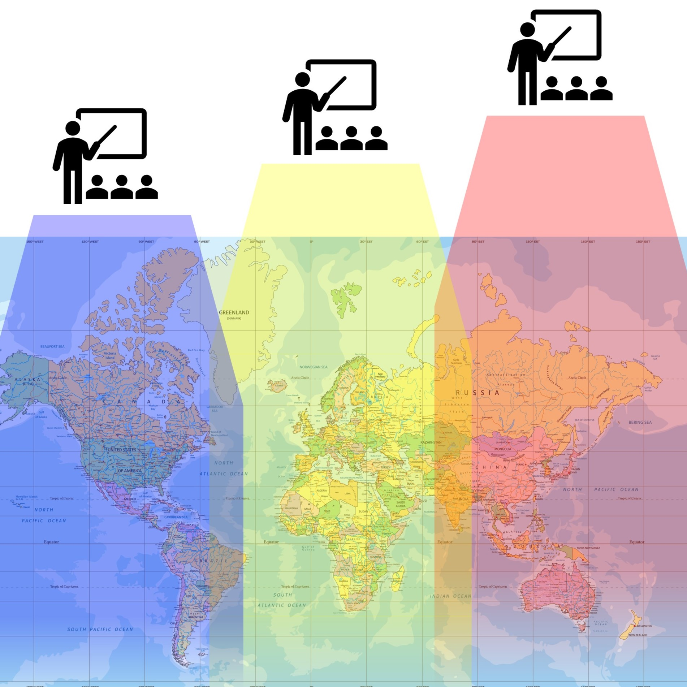

This page to display our long term goals in the SCUTTLE Nigeria project. 

## Initiating
The lab at FUTO beginning in 2024 is a key milestone to greater aspirations to enhance learning & STEM opportunities in Nigeria & Africa.

_our priority is the student_

From the beginning, our priority is the success of the student in learning.  If the students succeed, everything succeeds.  Engineering businesses get attracted to hire, professors become more involved, and distributor companies jump in to donate parts.  All we need to do is make sure the students are accomodated at every turn.

Since the whole project is open source, any individual may take initiative to use the designs & content to create new outcomes in their place of study & work.  So, our goals within the SCUTTLE Organization must be focused on supporting rather than controlling that which is made from the seed projects.

## Connecting
Connecting our learners & researchers is a central goal, always.  We want to make sure that experience can be exchanged between Asia, Africa, and the Americas.  This triad is a perfect starting point to cover all of the world's time zones.  Learners naturally exchange questions on Discord and post their projects on Youtube, Github, and other hubs for documentation.   But, realtime exchange has a tenfold impact.  

_visualizing time zones and overlaps for supporting each other_

Perspective of USA: as of 2023, we could only collaborate with Asia in the early morning and late evening.  Our 8am is their 8pm.  As soon as we start our real engineering work for the day, they are getting ready for sleep.

Perspective of Nigeria:  In the first half of the day, the students in Lagos can ask questions from all of the Asia community.  In the second half of the day, they can easily reach us in the USA.  For the first time we will have a student laboratory with 24 hours of expert support!
