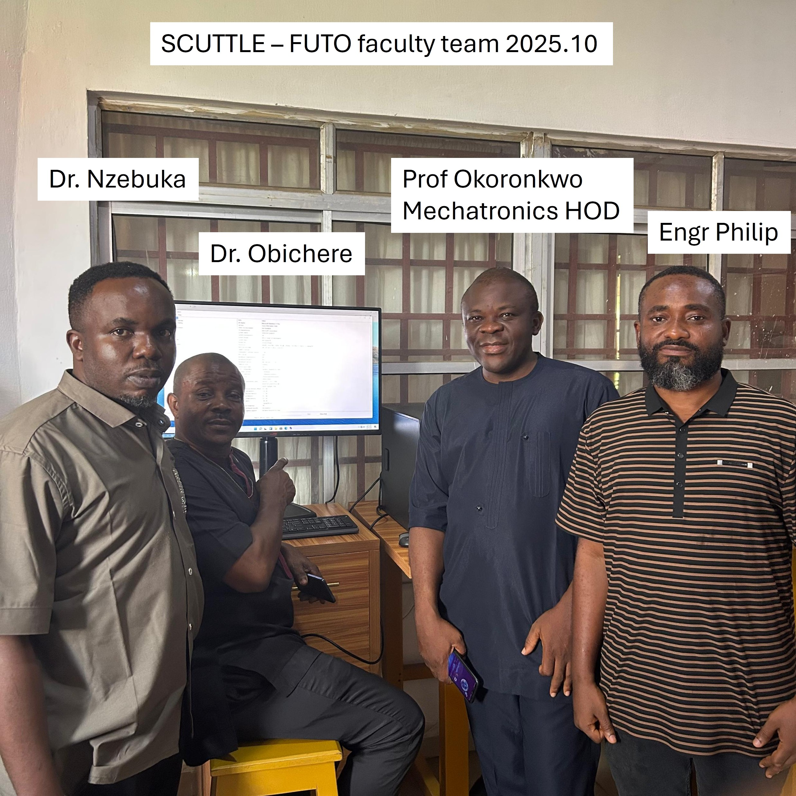
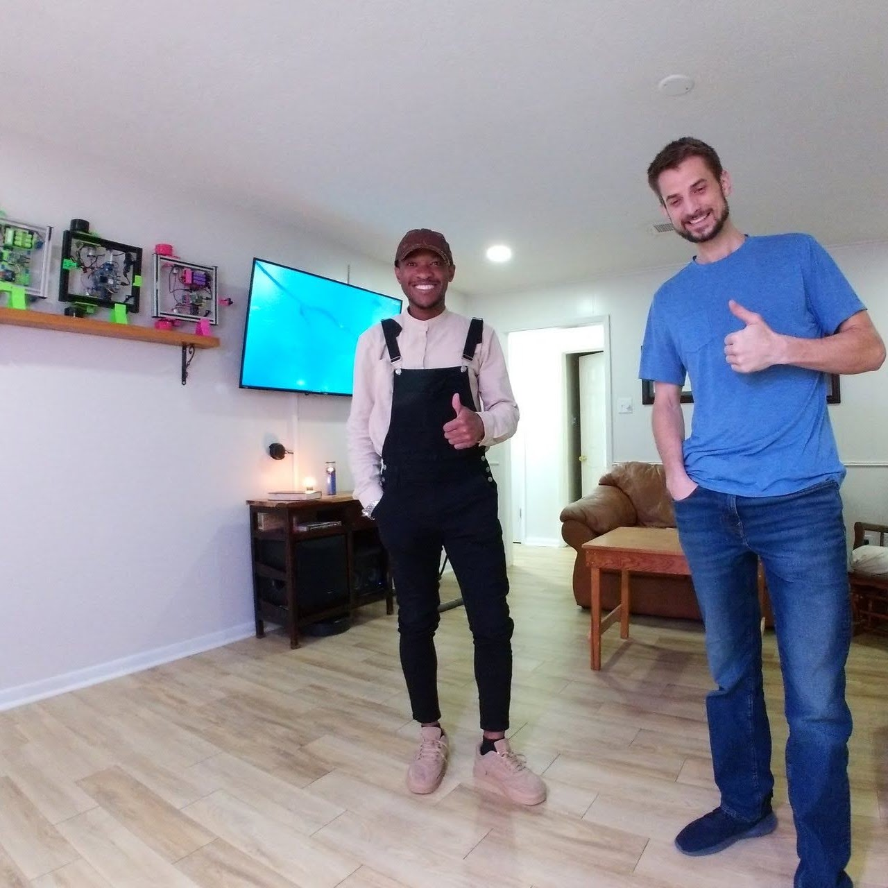

_latest dynamic link: https://qr.net/scuttleafrica (2025.05.02)_

# Intro
SCUTTLE Robotics in Nigeria.  Who is involved? What are we doing?  How can you help?  What is driving our plans?

## Community
>
> Please see our [GOFUNDME](https://gofund.me/72e9c8e8) - can you afford to make a $5 donation? 😙
>
> Join our [DISCORD](discord.gg/Napn9mhd43)
> to chat in realtime with our open community.
>
>🙂
>

 
 _Global collaboration taking place between SCUTTLE Labs across the world, with Nigeria at the center._

 The basic idea is to build the supporting infrastructure for Nigerian students to learn & create with robotics.  The method is to support each other from within our key SCUTTLE labs in the USA, Malaysia, and Nigeria.

**Supporting Faculty**
As of 2025.10, multiple faculty members from mechatronics engineering degree program got involved to make the lab come together.  The main focus this summer has been to get an extruder fabricated, which will produce filament for the 3D printers in the lab.  Dr. Nzebuka shared this photo including himself, Dr Obichere, Prof Okoronkwo the Mechatronics Engineering HOD, Engr Philip

_Dr. Nzebuka visits SCUTTLE Texas in 2022_

In one of our earliest meetings, Dr. Gaius Nzebuka (center of photo) urged us to assist him in bringing this tech to his home university in Owerri.

## Nigeria Outlook

Why Nigeria? (by David): Our SCUTTLE goals are centered on making the biggest impact, achieving a sustainable ecosystem for STEM learners to help each other, and making tech skills available to everyone.  I see the continent of Africa as the next step to enabling the global community of makers to find help in every time zone around the globe.  My experience in Southeast Asia taught me that students in developing regions are an incredible force in forging new technology.  By late 2023, our Malaysian research teams have outpaced our counterparts in Texas where the designers have more credentials, more funding, bigger campuses and more tools. It's exactly the opposite of what I expected. Perhaps the passion and motivation is the biggest barrier and perhaps the phenomenon of being a little fish in a big pond is an intense drawback for the students in major universities.

>
> Story:
>
>
> In 2022 I met Dr. Nzebuka, a professor in Nigeria and a visiting researcher at Texas A&M.  By his account, his students back at FUTO are eager to explore robotics but need some simple guidance on where to start. FUTO and Covenant university are universities positioned near the economic focal point in Nigeria, a city called Lagos which hosts manufacturing, oil & gas, and employers of STEM graduates.  So the key ingredients which drove a successful start in Malaysia are also ready in Nigeria:
> 1) students with existing STEM background
> 2) an economy pursuing automation and tech advancements
> 3) faculty & colleges actively teaching with hands-on projects.
>
> Our efforts are most successful in teach-the-teacher interactions. Sharing our free & open technology is done organically with human interactions, and is almost never successful through traditional marketing. The robot design is affordable & accessible, but the curriculum must be adapted to meet students at their level.  So, the path to success is to connect with one leader at a time and let them inform the process based on their group's expertise areas, equipment, infrastructure, and motivations. Robotics, just like Personal Computers in 1990, can benefit all types of learners and it starts with adapting the experience for the student.  We can only achieve this adapting and teaching with the help of a local champion.  All of our dreams of building the future begin with a few bold people, in one geographic hub at a time.
>
> Check out more background at the [research](research.md) page.
> 

## 2022 Starting Out

The concept of this first SCUTTLE robot lab in Nigeria originated with Dr. Gaius Nzebuka.  Dr. Nzebuka spent a period in 2022 as a research scholar at Texas A&M where the first discussions began.  Nzebuka worked in the lab of our new faculty, Dr. Ufodike and interacted with our former SCUTTLE team member Chukwubuikem Ewelike, who introduced myself and Dr. Nzebuka.  One saturday, I hosted everybody at the garage-based lab and we took a day to build some SCUTTLE kits and get introduced to what's involved.

 
_Buikem, our Nigerian American colleague at DMD Lab for his grad studies._   

_David gets an introduction to the DMD Lab of Dr. Ufodike, at Texas A&M_

In 2023, Phillip also visited Texas and I worked with him to share what challenges we solved to create an educational lab in Malaysia.  Phil has extensive experience in creating digital educational content as well as overseas philanthropic projects.  We actually knew one another from Missouri Science & Technology (formerly UMR) when both of us worked on the Guatemala water project, circa 2009.  So, in several regards the opportunity was transparent and Phil took on the challenges of researching where and how to plug in the robotics education, starting from the whole continent of Africa. 

 
_Dr. Nzebuka building robots in Texas_    

_FUTO campus_

In late 2023 Philip actually built two extensive reports to seek funding from Microsoft and we collaborated on a second grant proposal for a Texas A&M call for proposals. Those got submitted and set on the shelf while Phil continued heavy research.  Phil compiled nearly 50 direct interviews with Nigerian students and Researchers to gather the state of STEM education & robotics.  We did not document things nicely enough to publish because action ramped up before we got there! The situation of robotics in Nigeria is a complex one with a great deal of talent and many barriers to proper resources, but in summary, it advises extreme thoughtfulness about where we can plant a seed - send equipment and collaborate with an educator to offer a tailored curriculum in the context of their university setting.

In the same year, Dr. Nzebuka returned to Nigeria and returned to a full-time faculty member at Federal University of Technology, Owerri (FUTO).  It is possibly the most highly regarded state university in Nigeria for STEM training.  We also looked closely at Covenant university which is a privately funded uni, and it is also a leader which we hope to connect with.  Making efforts in FUTO agreed nicely with Phil's independent research on the best places to start. 

## 2024 Ramping Up

Our north american team shipped the first parts to FUTO!  This was a big milestone in funding, shipping parts to a new continent, and readiness to make huge changes on the side of Dr. Nzebuka's team.  We can't express how grateful we are to have a welcoming and trusting group on the Nigeria side of the project to allocate space and time from many people to "break ground."  The infrastructure, security, and coordination has much to speak of with this kind of project - we, as an open-source organization, do not have authority over any decisions at this public university and it is not so much "our project" as a project we are working to support.  So, big thanks to everyone involved as we can soon come to the actual robotics part of the journey.

_Preparing kits & tools for Nigeria shipment_

_David & Phil working in the office_

Such a perfect coincidence arrived in October! Samuel, shown below is a mechanical engineer from Nigeria who I met in a book club (totally unrelated to SCUTTLE). As it turned out, he studied at FUTO for his undergrad and has great insights to share with me since I've not yet traveled to Nigeria.  We had a short discussion for Q&A from my many questions about his experience and their university and it's going to fill gaps in our USA team awareness.   Samuel doesn't know yet but we are going to make him an advisor to the project. ☺

_David & Samuel meeting in Texas with Photo credit to the Astro Robot_

# References:

## External
_key sources for background information_
* [Website of SCUTTLE Futo team](https://scuttle-ng.vercel.app) initiated in early 2025, to include updates directly from Dr. Nzebuka's team of engineers. 
* [Federal University of Technology - Owerri](https://futo.edu.ng/department-of-mechatronic-engineering/) - FUTO has a mechatronics department with capable students & researchers.
 * [Dr. Nzebuka at FUTO](https://futo.edu.ng/engr-dr-g-c-nzebuka/) - link to faculty profile for Dr. Nzebuka
* [Covenant University](https://covenantuniversity.edu.ng/) - Covenant is a national leader in education, a private university with a strong and stable reputation.

## Internal
_links and summarized info for onboarding new team members and for recalling data in more detail._
* [SCUTTLE Tech Guide](https://qr.scuttlerobot.org/g/12J5i2t3bp4) - our SCUTTLE engineering guide, beginning 2023 and publicly edited.
* [SCUTTLE Homepage](https://scuttlerobot.org) - the SCUTTLE website
* [David's Youtube](https://https://youtu.be/H6BFeo9z46w?si=ZsQpJ6WKRSaVEryH) with recent updates about the Nigeria SCUTTLE Lab.

