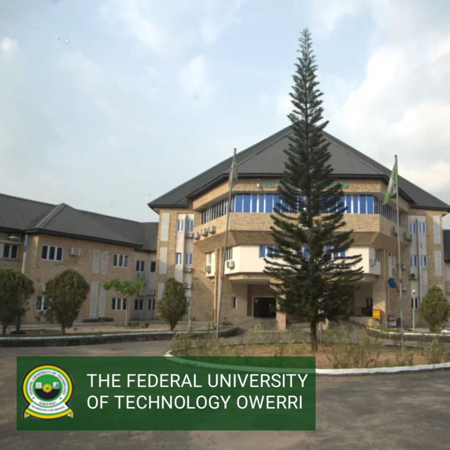
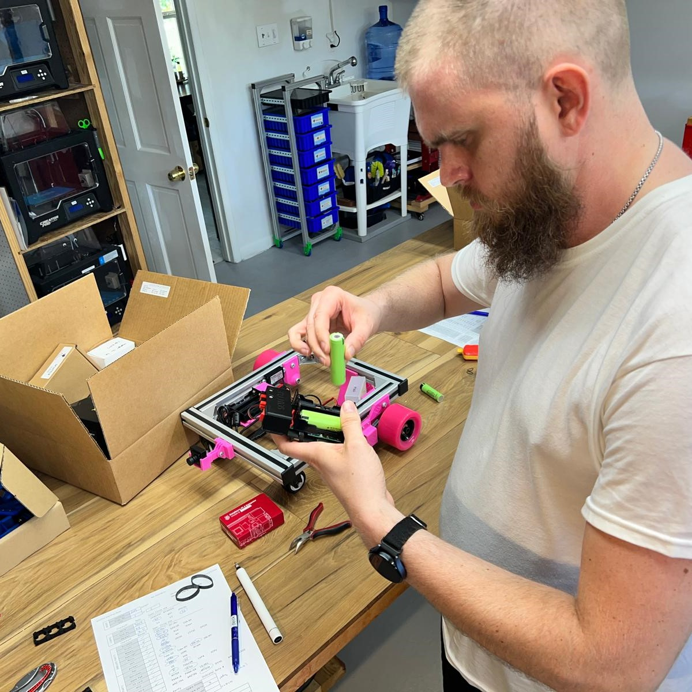

_qr code is accessible at https://qr.page/g/leQK0r6g6q_

# SCUTTLE Nigeria
Updates for Robotics in Nigeria.  Who is involved? What are we doing?  How can you help?  What is driving our plans?

 
 _Themes for 2024 in one infographic_

 The basic idea is to build the supporting infrastructure for Nigerian students to learn & create with robotics.

_Dr. Nzebuka visits SCUTTLE Texas in 2022_

In one of our earliest meetings, Dr. Gaius Nzebuka (center of photo) urged us to assist him in bringing this tech to his home university in Owerri.

# Latest

The lab is being assembled!  FUTO faculty have allocated a space for teaching robotics, and our Nigerian team members are installing solar panels, power storage, furniture & security features for the new lab space.  Robot kits have arrived onsite after a very long shipping period and Dr. Nzebuka & his colleagues plan to teach with the equipment this fall semester. 

# Leadership

## Nigeria

This table to be populated with key contacts globally who are supporting the project, starting in 2022.

* Dr. Gaius Nzebuka is the key responsible person for the 2024 robotics lab supported by SCUTTLE Robotics organization.  He has direct experience with our Texas learning environment based on his work at Texas A&M, and a mechanical engineering educational background. 
* Dr. Olalekan Olayinka is our primary contact at Covenant University, also near to Lagos, Nigeria and a key consultant for our planning in African robotics efforts.  Dr. Olalekan is equipped to set up stakeholders in the academic space (that includes Students, Professors, lecturers, and university management) to embrace the learning opportunities in the field of robotics that will be provided by SCUTTLE.
* Several faculty members at FUTO are colleagues of Dr. Nzebuka who will likely get involved at the new lab there, and I hope to credit them as the year progresses and we can know more details.

## North America

* Philliip McGee is our spearhead for planning the Africa-based activities for the SCUTTLE org since around 2023.
* David Malawey is dedicating technical efforts, and documenting content to share (such as this web page) to keep the door open for collaborators.
* Viam is an exciting business partner who has created several software solutions & easy-to-follow tutorials and we are keeping their team up to speed to engage with the Nigeria group whenever appropriate.  A couple of their staff including Sara Gharnit and Nick Hehr have already performed live webinars for our Malaysia based workshops (THANK YOU SO MUCH!) and we hope to connect them again to kick off viam-on-scuttle software lessons soon.

## Asia
* Dr. Norazmi, as always, has been a guiding participant in the Africa plans as his education/business/government experience is a fantastic resource to choose how to make similar progress in Nigeria as we have in Malaysia.

## Robotics Education in Nigeria

> Why Nigeria? (by David): Our SCUTTLE goals are centered on making the biggest impact, achieving a sustainable ecosystem for STEM learners to help each other, and making tech skills available to everyone.  I see the continent of Africa as the next step to enabling the global community of makers to find help in every time zone around the globe.  My experience in Southeast Asia taught me that students in developing regions are an incredible force in forging new technology.  By late 2023, our Malaysian research teams have outpaced our counterparts in Texas where the designers have more credentials, more funding, bigger campuses and more tools. It's exactly the opposite of what I expected. Perhaps the passion and motivation is the biggest barrier and perhaps the phenomenon of being a little fish in a big pond is an intense drawback for the students in major universities.
>
> In 2022 I met Dr. Nzebuka, a professor in Nigeria and a visiting researcher at Texas A&M.  By his account, his students back at FUTO are eager to explore robotics but need some simple guidance on where to start. FUTO and Covenant university are universities positioned near the economic focal point in Nigeria, a city called Lagos which hosts manufacturing, oil & gas, and employers of STEM graduates.  So the key ingredients which drove a successful start in Malaysia are also ready in Nigeria:
> 1) students with existing STEM background
> 2) an economy pursuing automation and tech advancements
> 3) faculty & colleges actively teaching with hands-on projects.
>
> Our efforts are most successful in teach-the-teacher interactions. Sharing our free & open technology is done organically with human interactions, and is almost never successful through traditional marketing. The robot design is affordable & accessible, but the curriculum must be adapted to meet students at their level.  So, the path to success is to connect with one leader at a time and let them inform the process based on their group's expertise areas, equipment, infrastructure, and motivations. Robotics, just like Personal Computers in 1990, can benefit all types of learners and it starts with adapting the experience for the student.  We can only achieve this adapting and teaching with the help of a local champion.  All of our dreams of building the future begin with a few bold people, in one geographic hub at a time.

## Starting in 2022

The concept of this first SCUTTLE robot lab in Nigeria originated with Dr. Gaius Nzebuka.  Dr. Nzebuka spent a period in 2022 as a research scholar at Texas A&M where the first discussions began.  Nzebuka worked in the lab of our new faculty, Dr. Ufodike and interacted with our former SCUTTLE team member Chukwubuikem Ewelike, who introduced myself and Dr. Nzebuka.  One saturday, I hosted everybody at the garage-based lab and we took a day to build some SCUTTLE kits and get introduced to what's involved.

| Images | ... |
| ---------- | ------------------- | 
|  |  |
| Buikem at DMD Lab for grad work     | David gets introduction to DMD Lab, Texas A&M  |

In 2023, Phillip also visited Texas and I worked with him to share what challenges we solved to create an educational lab in Malaysia.  Phil has extensive experience in creating digital educational content as well as overseas philanthropic projects.  We actually knew one another from Missouri Science & Technology (formerly UMR) when both of us worked on the Guatemala water project, circa 2009.  So, in several regards the opportunity was transparent and Phil took on the challenges of researching where and how to plug in the robotics education, starting from the whole continent of Africa. 

| Images | ... |
| ---------- | ------------------- | 
|  |  |
| Dr. Nzebuka building robots in Texas    | FUTO campus  |

In late 2023 Philip actually built two extensive reports to seek funding from Microsoft and we collaborated on a second grant proposal for a Texas A&M call for proposals. Those got submitted and set on the shelf while Phil continued heavy research.  Phil compiled nearly 50 direct interviews with Nigerian students and Researchers to gather the state of STEM education & robotics.  We did not document things nicely enough to publish because action ramped up before we got there! The situation of robotics in Nigeria is a complex one with a great deal of talent and many barriers to proper resources, but in summary, it advises extreme thoughtfulness about where we can plant a seed - send equipment and collaborate with an educator to offer a tailored curriculum in the context of their university setting.

In the same year, Dr. Nzebuka returned to Nigeria and returned to a full-time faculty member at Federal University of Technology, Owerri (FUTO).  It is possibly the most highly regarded state university in Nigeria for STEM training.  We also looked closely at Covenant university which is a privately funded uni, and it is also a leader which we hope to connect with.  Making efforts in FUTO agreed nicely with Phil's independent research on the best places to start. 

## Ramping up in 2024

Our north american team shipped the first parts to FUTO!  This was a big milestone in funding, shipping parts to a new continent, and readiness to make huge changes on the side of Dr. Nzebuka's team.  We can't express how grateful we are to have a welcoming and trusting group on the Nigeria side of the project to allocate space and time from many people to "break ground."  The infrastructure, security, and coordination has much to speak of with this kind of project - we, as an open-source organization, do not have authority over any decisions at this public university and it is not so much "our project" as a project we are working to support.  So, big thanks to everyone involved as we can soon come to the actual robotics part of the journey.

| Images | ... |
| ---------- | ------------------- | 
|  |  |
| preparing kits & tools for Nigeria shipment  | working in the office  |

# References:

## External References
_key sources for background information_
* [Federal University of Technology - Owerri](https://futo.edu.ng/department-of-mechatronic-engineering/) - FUTO has a mechatronics department with capable students & researchers.
 * [Dr. Nzebuka at FUTO](https://futo.edu.ng/engr-dr-g-c-nzebuka/) - link to faculty profile for Dr. Nzebuka
* [Covenant University](https://covenantuniversity.edu.ng/) - Covenant is a national leader in education, a private university with a strong and stable reputation.

## Internal References
_links and summarized info for onboarding new team members and for recalling data in more detail._
* [SCUTTLE Tech Guide](https://qr.scuttlerobot.org/g/12J5i2t3bp4) - our SCUTTLE engineering guide, beginning 2023 and publicly edited.
* [SCUTTLE Homepage](https://scuttlerobot.org) - the SCUTTLE website

