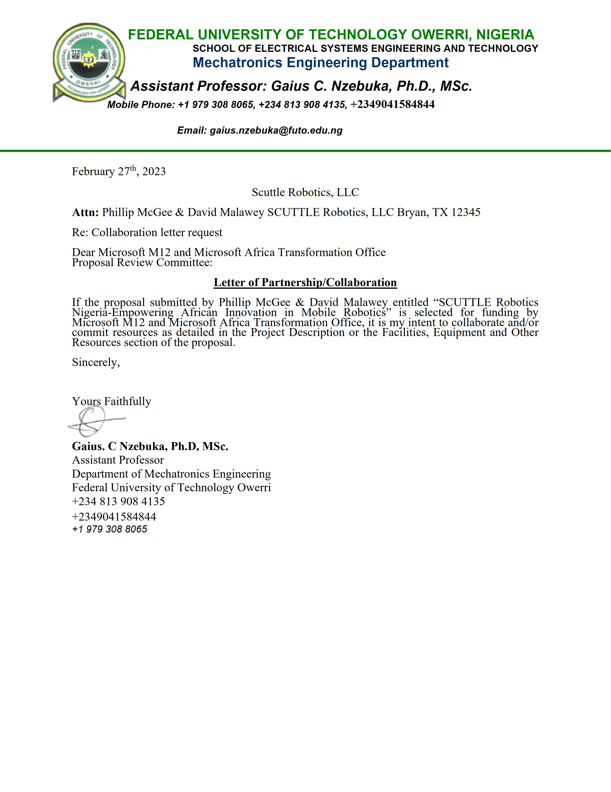
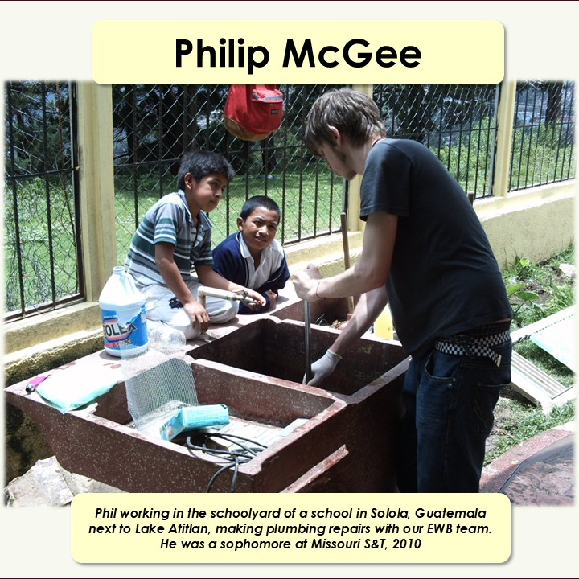
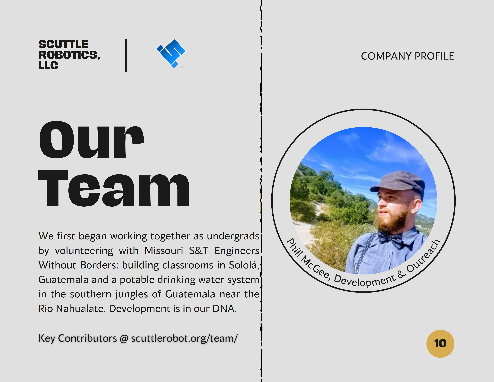

Access our past research & proposal compilations from 2022 through 2025

## Ecosystem

_Note from DM, 2025 April_
In the course of seeking grants and collaboration with larger players, Phil undertook two years of deep research in the ecosystem in Nigeria.  It is natural for large institutions to require a heavy assessment in the viability of project outcomes, to prove the awardee has a clear plan and understanding of real-life barriers to any project.  This is beyond the scope of plain engineering so I just want to give a huge applause to Philip for single-handedly engaging for many months to get real assessment data.  As of 2025, no grants were yet awarded but the research and information still holds a great deal of value.  For future projects or grants I recommend that our team members download and peruse any reports posted here before taking new steps.

* Download [Nigeria Synthesis Report, 2024](https://github.com/scuttlerobot/nigeria/blob/d9e29f293e3864cb3f10d337a2e7554e5f5197a8/docs/2024.09_NigeriaSynthesisReport.pdf)

## Microsoft_ATO

_Note from DM, 2025 April_

This segment is for publishing our 2023 proposal to [Microsofts ATO organization](https://www.microsoft.com/africa/ato/sme).  The Africa Transformation Office offers grants & collaborations for small to medium enterprises (SME's) that develop technology projects.  Phillip studied the ATO goals as well as the background required for a SCUTTLE Robotics Endeavor to align with the ATO grants.   The following is a PDF submitted in 2023 to ATO.  This may be an annual offering that is worth a second attempt.

* Download [2023 Proposal for SCTL Nigeria](https://github.com/scuttlerobot/nigeria/blob/06f4cc12aa1bdf2a74f6e29c409650c3156dba89/docs/2023_proposal_ATO.pdf)

## FUTO

In the early stage of planning efforts in Africa we explored many universities with which to partner.  It was providential to connect in person at Texas A&M with Dr. Gaius Nzebuka which led us to pursue our work with FUTO specifically.  Here's our initial letter of collaboration with SCUTTLE organization and Federal University of Technology Owerri.

* Download [2023.02_collaborationFUTO.pdf](https://github.com/user-attachments/files/20019680/2023.02_collaborationFUTO.pdf)

## Dedication
_on dedication and service to humanity_

I am sharing just a couple of images to share the immensely humble and passionate help our community received from Phillip.  He is the quiet type of genius thinker who is happy to sweat and grind over long periods to see good things happen for people in need.  I met Phil only by chance as he stumbled into the same service organization as myself in Rolla, Missouri around 2010.  We met during travel to this remote village in Guatemala at the peak of a mountain overlooking a lake, where kids in the poorest of conditions attended a school that was undermaintained.  We were only acquaintences when I graduated college in 2011 and over a decade had passed when I stumbled into him on linkedin.  As I told him about the SCUTTLE project he was thrilled to make a trip to Texas on his own funds to learn more and help us reach our first results in Nigeria.  Up until 2025 we both have put in all of our hours for the SCUTTLE organization unpaid, because we are operating out of purpose but I must admit on any given day I have much more to gain as the founder than he does at this very moment.  The second photo is just snipped out of one of our presentations compiled with Phil's photo included, and seeing these photos next to one another is just amazing to me.  I had no idea we would cross paths again in life, and once again to impact the world.

- 
- 
