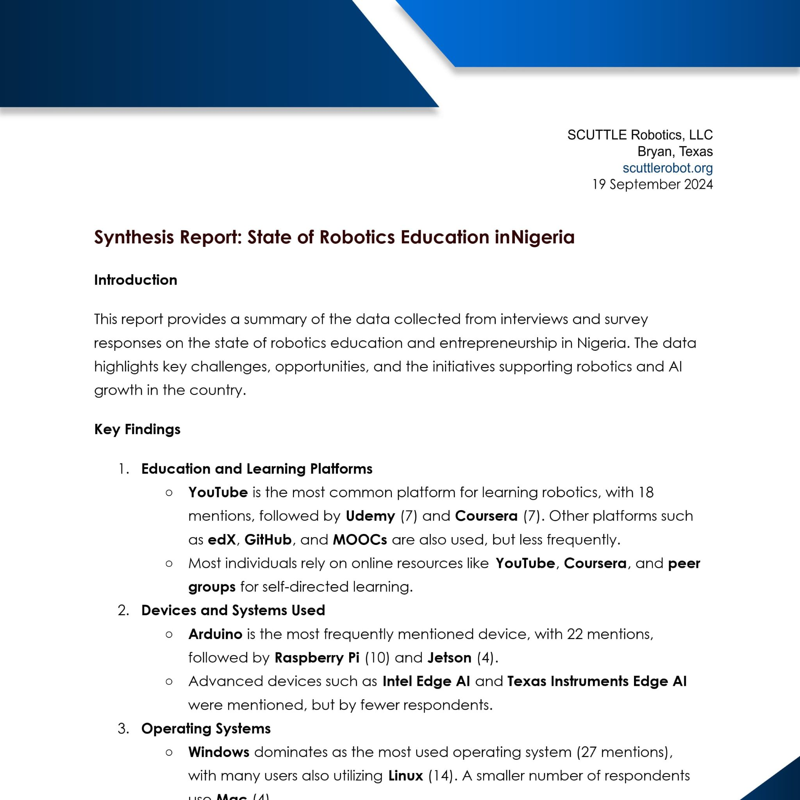

Content coming soon!

## Ecosystem

_Note from DM, 2025 April_
In the course of seeking grants and collaboration with larger players, Phil undertook two years of deep research in the ecosystem in Nigeria.  It is natural for large institutions to require a heavy assessment in the viability of project outcomes, to prove the awardee has a clear plan and understanding of real-life barriers to any project.  This is beyond the scope of plain engineering so I just want to give a huge applause to Philip for single-handedly engaging for many months to get real assessment data.  As of 2025, no grants were yet awarded but the research and information still holds a great deal of value.  For future projects or grants I recommend that our team members download and peruse any reports posted here before taking new steps.

* Download [Nigeria Synthesis Report, 2024](insertLinkHereForReport)

## Microsoft_ATO

_Note from DM, 2025 April_

This segment is for publishing our 2023 proposal to Microsofts ATO organization.  The Africa Transformation Office offers grants & collaborations for small to medium enterprises (SME's) that develop technology projects.  Phillip studied the ATO goals as well as the background required for a SCUTTLE Robotics Endeavor to align with the ATO grants.   The following is a PDF submitted in 2023 to ATO.  This may be an annual offering that is worth a second attempt.

* Download [2023 Proposal for SCTL Nigeria](https://github.com/scuttlerobot/nigeria/blob/06f4cc12aa1bdf2a74f6e29c409650c3156dba89/docs/2023_proposal_ATO.pdf)

